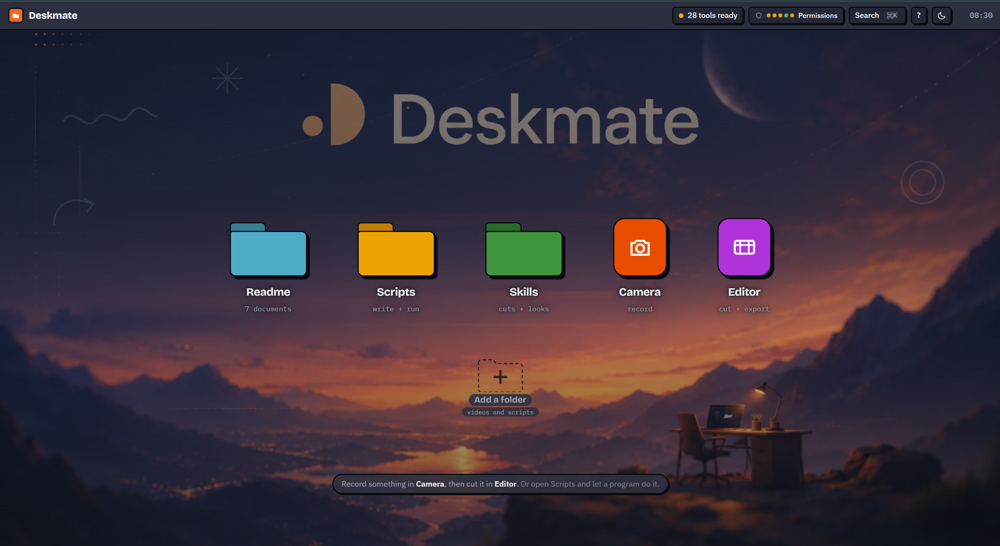

# Deskmate

**A whole content studio in one browser tab where an AI agent and a human can work together inside it.**
Write the script, read it off the teleprompter while recording and edit it with an
AI agent on the same page as you the entire time, through **WebMCP**.



**Try it:** <https://deskmate-cc.vercel.app> · **Submission:** [The WebMCP Challenge](https://webmcp.devpost.com) · **Build:** [architecture notes](docs/ARCHITECTURE.md)

---

## Features

Five apps, each in a window you can drag, stack, resize, minimise and close.

### Scripts

Write your script line by line, with optional notes for camera shots, b-roll and tone. You can switch between a writing view and a shot list, keep research alongside it, and see the estimated video length as you write. AI can suggest ideas and help you writing the script!

### Teleprompter

Read your script while recording, with adjustable scrolling speed. The prompter also keeps track of which line you were reading and when, which becomes useful later for the transcript and editing.

### Skills

Deskmate includes a set of **custom AI Skills** that teach an agent how to work with the app. You can also create your own, so the AI can follow your preferred editing style or workflow.

### Camera

Record your camera, microphone or even your screen! Your takes are automatically added to the editor, and the teleprompter can run directly over the camera preview.

### Editor

A full timeline for video, audio and graphics. You can trim, split, reorder and transform clips, add transitions and effects, change aspect ratios, and export your finished video directly from the browser.


### The desktop itself

Everything lives inside a desktop-style interface with draggable windows, a dock, launcher, light and dark themes, keyboard shortcuts, accessibility features and built-in documentation.

## WebMCP and AI integration

Deskmate exposes **28 WebMCP tools** that let an AI agent interact directly with the application. Some tools read the current state and others can propose changes.

The important part is that the agent can access things that normally only a user inside the page could see:
- Which line the teleprompter is currently on
- What the user is currently typing
- Which clip is selected and where the playhead is
- What words are being spoken at a specific point in the video
- What graphics and layers are currently on screen

There is also no backend. Everything stays in the browser, including the timeline and recorded clips.

When the AI makes a change, it doesn't just describe what to do. Its proposal appears directly on the timeline or preview, where the user can accept or reject it.

### Watching it work

A **ghost** names each tool as it is called, a cursor springs to the surface that call actually
touched and presses it, and the menubar badge tells "ready" from "connected" on purpose. All of
it is driven by real calls, never simulated.

## Judging it in five minutes

Open the site in **ChatGPT's browser**, or Chrome 149+ with
`chrome://flags/#enable-webmcp-testing`. The menubar badge says whether a host is attached and
whether it has actually called anything.

1. **Record ten seconds.** Open **Scripts**, pick the sample, open **Camera**, load the script,
   hit record and read a line off the prompter. Stop.
2. **Open the Editor.** Your take is on the timeline. Click the **Transcript** tab in the left
   rail; the words are already timed. Click one and the playhead goes to it.
   (Add an OpenAI key for more precision)
4. **Paste this to the agent:**

   > *Look at my timeline, then build me an opening title sequence. Give me a title card, a
   > lower third with my name, and a stat badge, and put each one on a real moment in the
   > transcript rather than all at the start. Add a whoosh under the title. Then show me what it
   > would look like as a 9:16 short.*

5. **Watch the proposals arrive dashed** on the timeline, previewing live. Accept one, reject
   one. Then ask it to **"hold the title two seconds longer"**: it reads back what you kept and
   changes only that. This compounding turn is the whole argument.
6. **Ask it to "tidy up the ums."** One call marks every hesitation and every silence, each
   with its own reason, to take or leave one at a time.
7. **Then ask for a look**: *"redo the title, but make it glassmorphic"*, or *"go maximalist"*.
   A skill fires on those words and hands the agent an exact recipe, which is the difference
   between an agent that can call your tools and one that knows your app.
8. **Export.** It replays into a canvas in real time and lands back in your library.
   

## What makes this different

Three things, and the first is the one we would point at.

### 1. AI Skills, so the agent already knows how to use this app

**Tools tell an agent what it *can* do. They say nothing about how this app wants it done.** So a folder of markdown does that instead.

An AI Skill is a `.md` file with frontmatter, in the SKILL.md convention agents already understand:

```markdown
---
name: Motion graphics that look designed
description: Use whenever you are asked for a title, an animation, an infographic, a stat...
triggers: timeline_has_clips, graphic, animate, motion, title, keynote, slop
---

The body: exact recipes, the house rules, and what never to do.
```

**Skills fire on their own.** A trigger is either a signal the page computes about itself, or a
word to look for in what you actually wrote:

| Trigger kind | Examples |
|---|---|
| A signal the page computes | `timeline_has_clips`, `research_has_url`, `recording`, `script_empty`, `graphics_pending` |
| A word in what you wrote | `glassmorphic`, `hook`, `youtube`, `slop`, `infographic` |

When one matches, **every read tool starts carrying the suggestion in its own result**, along
with the line: *"The person left these instructions for this exact situation. Their instruction
for how they want this done beats your default."* A skill that has already been loaded stops
being offered, so the nudge never turns into noise.

Paste a YouTube link into Research and the next tool the agent calls tells it to read *Turn a
link into a script*. Ask for a title over a timeline that has clips on it and it is told to
read *Motion graphics that look designed* before it answers.

**Six ship with the app:**

| Skill | Fires when |
|---|---|
| Hook in the first three seconds | Your script has lines, or you say "hook", "opening", "intro" |
| Turn a link into a script | Your Research pane has a URL in it |
| Building a motion graphics clip | Your timeline has clips and you ask for a graphic |
| Taste, not slop | You ask for copy, a headline or a caption, or you say "generic" |
| Motion graphics that look designed | Any graphic ask. Exact recipes, so the result reads like a keynote and not a template |
| Loud looks: glass and maximalist | You ask for "glassmorphic", "maximalist", "vaporwave", "y2k", "wildly different" |

**And you write your own.** Drag a `.md` onto the folder, press Add, or press New and write one
in the app: your house style, your client's brand, the way you want your lower thirds worded.
It is saved in your browser, and the next agent to read this page follows it.

That is the claim worth testing. **ChatGPT turns up already knowing how to use this app, and
you can teach it more yourself without touching a line of code.**

### 2. Motion graphics, from a spec the agent fills in

A video editor an agent can drive is one thing. One that can *design* is another.

The agent never writes CSS, SVG or JavaScript. It fills in a constrained declarative object,
and one render function draws that object twice: onto a transparent canvas over the preview,
and onto the canvas the export is recording. Same function, same spec, same pixels, so what you
approve is exactly what gets written to the file.

- **Fourteen components**: title card, lower third, caption pop, bullet list, comparison cards,
  process flow, stat badge, callout arrow, progress bar, code card and quote card, plus three
  free-form ones: **text** you style completely, a **shape** in eight kinds, and a full-frame
  **effect** (dip, flash, vignette, grain, scanlines, glitch, letterbox, wash).
- **Integer frames at 30fps**, so a frame renders the same every time it is asked for, and the
  export can draw frame 512 without having drawn 511.
- **`interpolate` and `spring`** are pure functions of the frame, so nothing gets out of step
  when the playhead jumps.
- **Colour is a role by default.** `accent` resolves against the live theme, so one spec stays
  legible in light and dark. A hex is accepted where a person has picked one deliberately.
- **Geometry is normalised**, so a graphic approved on a 468px preview is correct in a 4K
  export, and reframing to 9:16 moves no layer.
- **Synthesised sound**: six effects generated in Web Audio, plus a music bed that ducks itself
  under speech.

### 3. The teleprompter is also the transcript

The prompter does double duty. Every take records which script line was on screen at which
second, so that log plus the script gives you a transcript without uploading anything: we know
what was said, because you read it, and roughly when, because we watched you advance it. Words
are spread across their line by length.

It is an estimate and it says so, marked `source: "prompter"` and `approximate: true`. Usually
that is enough to find a phrase and land a graphic on it. For measured per-word timing, paste
your **own OpenAI key** into the Transcript panel and any clip re-transcribes with Whisper. The key
stays in this browser's `localStorage` and is sent nowhere but `api.openai.com`.

## Run it

```bash
npm install
npm run dev      # http://127.0.0.1:5173
npm run build    # static output in dist/, deploys as-is
```

Camera and screen capture need a secure context, so `https://` or `localhost`.

No framework for the design system, no component library, no encoder dependency. Vite, React
for the chrome, Tailwind utilities only, and vanilla DOM for the desktop itself.

## More

- [**docs/ARCHITECTURE.md**](docs/ARCHITECTURE.md) for every tool, the composition engine, how
  transcripts are derived, how export works, and a map of every file.
- The **Readme** folder inside the app is the same story, written for whoever is using it.

## Licence

MIT. See [LICENSE](LICENSE).
