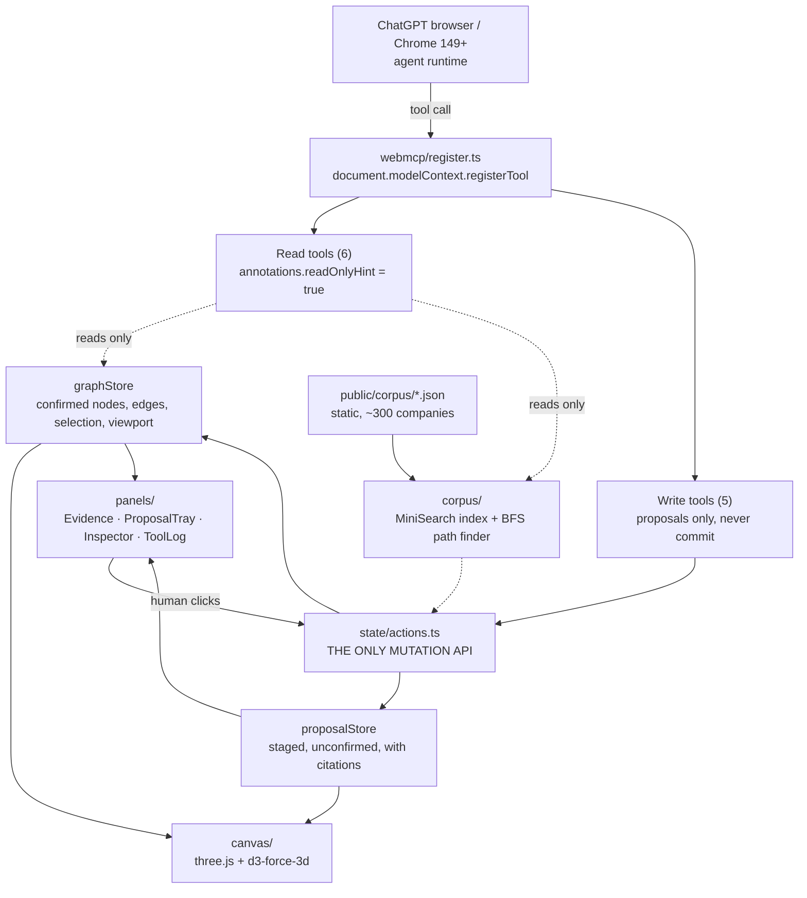
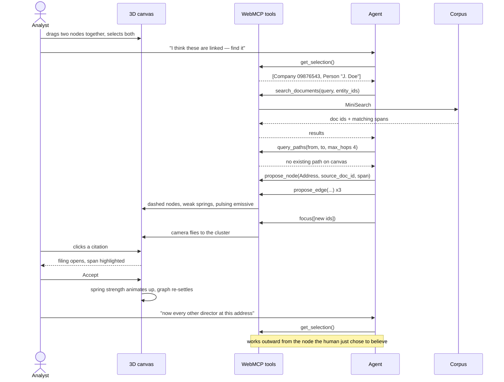
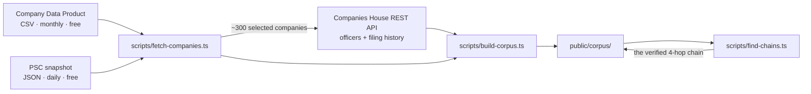

# Architecture

## The one rule

**`src/state/actions.ts` is the only thing that mutates state.** The human's clicks and the agent's
tool calls both go through it. A tool never touches a store directly, and never contains logic the
UI doesn't also use.

This is not tidiness. It is the architecture that makes the product's claim true: the human and the
agent are equal actors on one model, not a UI with a bot bolted on. It also happens to be exactly
what OpenAI's site-tools guidance asks for ("reuse your existing application logic and
permissions"), and it is a sentence worth putting in the Devpost write-up.

## System



Note what is *not* in that diagram: a server. The corpus is static JSON fetched once at load. Every
tool executes in the page. This is worth saying out loud in the write-up — it makes the WebMCP
argument pure, because the page genuinely is the API, and it means the agent can never reach data
the user can't see.

## The core loop



The second turn is the point. Nothing that scrapes a page can do it, because the thing the agent
needs — what the human just decided to trust — only exists in the live canvas.

## Offline data pipeline

Runs on your machine, never in the app.



## File tree

```
webmcp2026/
├─ README.md
├─ LICENSE                       MIT — required by the rules
├─ package.json
├─ vite.config.ts
├─ tsconfig.json
├─ index.html
├─ docs/
│  ├─ PLAN.md
│  ├─ ARCHITECTURE.md
│  ├─ TOOLS.md
│  ├─ UI-3D.md
│  └─ DATA.md
├─ scripts/                      offline only, never shipped
│  ├─ fetch-companies.ts         bulk CSV/JSON + REST API -> raw/
│  ├─ build-corpus.ts            raw -> public/corpus/*.json + MiniSearch index
│  └─ find-chains.ts             hunts for a non-obvious verifiable 4-hop chain
├─ public/
│  └─ corpus/
│     ├─ entities.json           companies, people, addresses
│     ├─ documents.json          filings, rendered as readable text with offsets
│     ├─ search-index.json       prebuilt MiniSearch index
│     └─ seed.json               the ~12 nodes the canvas opens with
└─ src/
   ├─ main.tsx
   ├─ App.tsx                    layout: canvas left, panels right, tool log bottom
   ├─ types.ts                   Entity, Edge, Document, Proposal, Citation
   ├─ state/
   │  ├─ actions.ts              ★ the only mutation API
   │  ├─ graphStore.ts           confirmed graph, selection, viewport
   │  ├─ proposalStore.ts        staged proposals awaiting a human
   │  └─ toolLogStore.ts         every WebMCP call, for the panel and the video
   ├─ corpus/
   │  ├─ loadCorpus.ts           fetch + hydrate once at boot
   │  ├─ search.ts               MiniSearch wrapper, returns ids + spans, never prose
   │  └─ paths.ts                BFS over adjacency, max_hops <= 4
   ├─ webmcp/
   │  ├─ register.ts             feature-detect document/navigator, register all 11
   │  ├─ schemas.ts              JSON Schema per tool, narrow inputs
   │  └─ tools/
   │     ├─ readTools.ts         6 read-only
   │     └─ writeTools.ts        5 staged writes
   ├─ canvas/
   │  ├─ GraphCanvas.tsx         react-force-graph-3d
   │  ├─ nodeObjects.ts          a three.js mesh per entity type + state
   │  ├─ linkObjects.ts          solid / dashed / particle-carrying
   │  ├─ physics.ts              force config, accept re-settle, reject impulse
   │  ├─ camera.ts               fly-to, focus, idle auto-rotate
   │  └─ bloom.ts                UnrealBloomPass on the composer (P1)
   ├─ panels/
   │  ├─ EvidenceDrawer.tsx      the filing, with the span highlighted
   │  ├─ ProposalTray.tsx        accept / reject queue
   │  ├─ Inspector.tsx           selected entity, its records, its edges
   │  └─ ToolLog.tsx             live WebMCP calls — this is video evidence
   └─ styles/
      └─ tokens.css              one palette, light and dark
```

## Boot order

1. `loadCorpus()` fetches the three JSON files and hydrates MiniSearch.
2. `graphStore` seeds from `seed.json` — about twelve nodes, deliberately sparse.
3. Canvas mounts, simulation starts.
4. `registerWebMcpTools()` runs **last**, after the stores exist, so no tool can be called against
   an empty world. Feature-detect first; if neither `document.modelContext` nor
   `navigator.modelContext` exists, log once and carry on — the app must still work as a normal
   web app in a normal browser.

## Corpus vs canvas — the distinction the whole design rests on

The **corpus** holds ~300 companies and everything attached to them: thousands of relationships that
genuinely exist in public records. The **canvas** holds only what has been pulled into view —
starting at twelve nodes, ending a session around forty.

Nothing is planted. The links the agent finds were always there in the filings; they simply were not
on screen. That is why the demo survives scrutiny, and it is also why performance is trivial: WebGL
is drawing forty nodes, not nine hundred.
