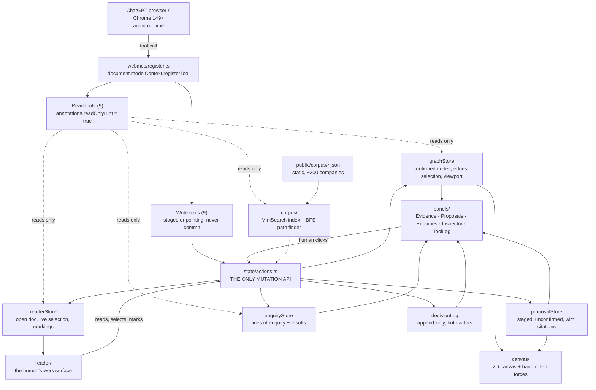
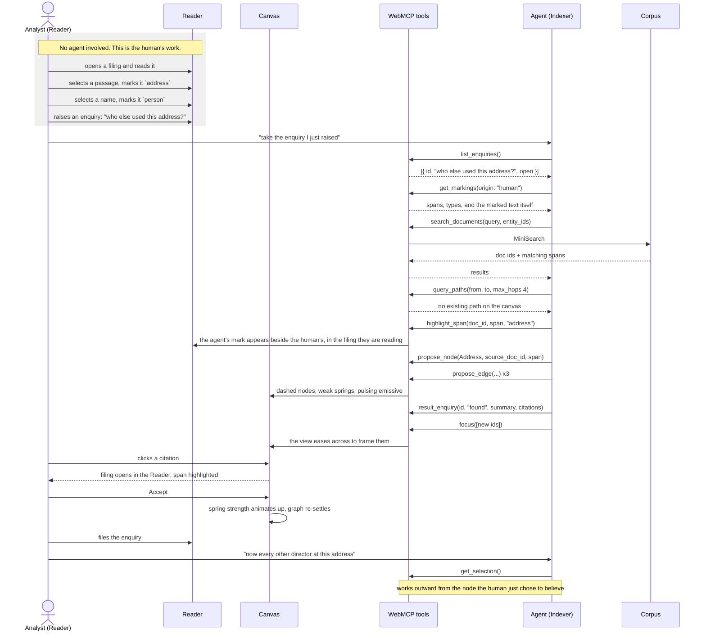
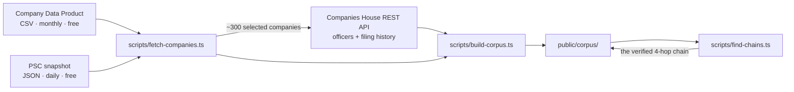

# Architecture

## The one rule

**`src/state/actions.ts` is the only thing that mutates state.** The human's clicks and the agent's
tool calls both go through it. A tool never touches a store directly, and never contains logic the
UI doesn't also use.

This is not tidiness. It is the architecture that makes the product's claim true: the human and the
agent are equal actors on one model, not a UI with a bot bolted on. It also happens to be exactly
what OpenAI's site-tools guidance asks for ("reuse your existing application logic and
permissions"), and it is a sentence worth putting in the Devpost write-up.

It holds for the reader too, and that is where it earns its keep. `highlight_span` from the agent
and a human dragging across a paragraph land in the *same* `addMarking` call, differing only in
`origin`. There is no agent-flavoured write path. If you ever find yourself adding one, the product
has stopped being what `docs/METHOD.md` says it is.

**The one asymmetry, and it is deliberate.** Four operations exist only for the human and have no
tool at all: promoting a proposal, filing an enquiry, raising an enquiry, deleting a marking. See
the table at the end of `docs/TOOLS.md`. `scripts/check-no-commit-tool.ts` enforces it in CI.

## System



The human's edges into `actions.ts` are as thick as the agent's. That is the diagram doing the
argument's work: `readerStore` is written by a person selecting text with a mouse and read by an
agent over WebMCP, through the same API, and neither side has a private door.

Note what is *not* in that diagram: a server. The corpus is static JSON fetched once at load. Every
tool executes in the page. This is worth saying out loud in the write-up — it makes the WebMCP
argument pure, because the page genuinely is the API, and it means the agent can never reach data
the user can't see.

## The core loop

The human reads first. Every version of this diagram that starts with the agent describes a
different, worse product.



Two things in there are the whole submission.

**The grey block.** It is the human doing the job — reading, marking, deciding what to ask — and it
happens before any tool is registered. Nothing in it degrades if the agent never arrives.

**`get_markings` and `get_reader_context`.** What the agent needs is a passage a person highlighted
in a client-rendered document ninety seconds ago, typed by them, with offsets into a string that
never left the browser. There is no server that holds it and nothing to scrape. The compounding
second turn on `get_selection` makes the same argument again on the canvas side.

## Offline data pipeline

Runs on your machine, never in the app.



## File tree

```
webmcp2026/
├─ README.md
├─ LICENSE                       MIT — required by the rules
├─ package.json
├─ vite.config.ts
├─ tsconfig.json
├─ index.html
├─ docs/
│  ├─ METHOD.md                  ★ the incident-room division of labour. Read first
│  ├─ PLAN.md
│  ├─ ARCHITECTURE.md
│  ├─ TOOLS.md
│  ├─ UI.md
│  └─ DATA.md
├─ scripts/                      offline only, never shipped
│  ├─ fetch-companies.ts         bulk CSV/JSON + REST API -> raw/
│  ├─ build-corpus.ts            raw -> public/corpus/*.json + MiniSearch index
│  └─ find-chains.ts             hunts for a non-obvious verifiable 4-hop chain
├─ public/
│  └─ corpus/
│     ├─ entities.json           companies, people, addresses
│     ├─ documents.json          filings, rendered as readable text with offsets
│     ├─ search-index.json       prebuilt MiniSearch index
│     └─ seed.json               the ~12 nodes the canvas opens with
└─ src/
   ├─ main.tsx
   ├─ App.tsx                    workspace switch: Read | Canvas, shared right rail, tool log bottom
   ├─ types.ts                   Entity, Edge, Document, Proposal, Citation, Marking, Enquiry
   ├─ state/
   │  ├─ actions.ts              ★ the only mutation API
   │  ├─ graphStore.ts           confirmed graph, selection, viewport
   │  ├─ proposalStore.ts        staged proposals awaiting a human
   │  ├─ readerStore.ts          open doc, live selection, markings   NEW
   │  ├─ enquiryStore.ts         lines of enquiry and their results   NEW
   │  ├─ decisionLog.ts          append-only, both actors, exportable NEW
   │  └─ toolLogStore.ts         every WebMCP call, for the panel and the video
   ├─ reader/                                                        NEW
   │  ├─ Reader.tsx              the filing, the margin, the human's work surface
   │  ├─ DocumentQueue.tsx       the working set of filings, and P1 upload
   │  ├─ selection.ts            selectionchange -> offsets. See the gotcha below
   │  └─ markings.ts             span layering and overlap resolution
   ├─ corpus/
   │  ├─ loadCorpus.ts           fetch + hydrate once at boot
   │  ├─ search.ts               MiniSearch wrapper, returns ids + spans, never prose
   │  └─ paths.ts                BFS over adjacency, max_hops <= 4
   ├─ webmcp/
   │  ├─ register.ts             feature-detect document/navigator, register all 11
   │  ├─ schemas.ts              JSON Schema per tool, narrow inputs
   │  └─ tools/
   │     ├─ readTools.ts         9 read-only
   │     └─ writeTools.ts        9 staged / pointing / reporting
   ├─ canvas/
   │  ├─ GraphCanvas.tsx         the rAF loop, pointer handling, focus
   │  ├─ simulation.ts           forces. No dependencies — see docs/UI.md
   │  ├─ render.ts               drawing, hit testing, label placement
   │  ├─ viewport.ts             pan / zoom / frame. No camera vector to collapse
   │  └─ palette.ts              mirrors tokens.css by hand
   ├─ panels/
   │  ├─ EvidenceDrawer.tsx      the filing, with the span highlighted
   │  ├─ ProposalTray.tsx        accept / reject queue
   │  ├─ EnquiryPanel.tsx        raise, delegate, file. The human's agenda   NEW
   │  ├─ DecisionLog.tsx         who did what, when, and why. Exportable     NEW
   │  ├─ Inspector.tsx           selected entity, its records, its edges
   │  └─ ToolLog.tsx             live WebMCP calls — this is video evidence
   └─ styles/
      └─ tokens.css              one palette, light and dark
```

## Boot order

1. `loadCorpus()` fetches the three JSON files and hydrates MiniSearch.
2. `graphStore` seeds from `seed.json` — about twelve nodes, deliberately sparse.
3. `readerStore` seeds its queue from the filings attached to those twelve nodes, and opens the
   first one. **The app opens on Read, not Canvas** — the analyst lands in a document, which is the
   product's whole claim about who does what.
4. Canvas mounts, simulation starts.
5. `selectionchange` listener attaches.
6. `registerWebMcpTools()` runs **last**, after the stores exist, so no tool can be called against
   an empty world. Feature-detect first; if neither `document.modelContext` nor
   `navigator.modelContext` exists, log once and carry on — the app must still work as a normal
   web app in a normal browser.

## The reader: offsets, selection, and the two ways this breaks

The entire evidence model rests on one invariant, and it now has a second consumer:

> **The text indexed offline is byte-for-byte the text the reader renders.**

`build-corpus.ts` emits each filing as plain text with stable character offsets. The Reader renders
that string verbatim into a `<pre>` and never reformats, re-wraps, trims or normalises it at display
time. Spans are indices into that exact string. Break this and every citation in the corpus quietly
points at the wrong words — and now every human marking does too, which is worse, because the human
made it and will trust it.

**Failure one: computing offsets from the DOM.** When the analyst selects text, do not walk
`Range.startOffset` across rendered nodes and hope. Render the document as a single text node per
segment and map the selection back to the source string, or — much cheaper, and what we should do
given three days — render the whole filing as one text node inside the `<pre>` and read
`selection.anchorOffset` / `focusOffset` directly against it, normalising the direction. Highlights
then split that text node into segments, so recompute the segment offsets from the marking list
rather than from the DOM.

**Failure two: reading the selection at tool-call time.** Covered in `TOOLS.md` under
`get_reader_context`, and worth repeating because it will look like a bug and is not: by the time
the agent invokes a tool the analyst has clicked into a different surface and
`document.getSelection()` is collapsed. Capture on `selectionchange` into `readerStore`; have the
tool read the store. Keep the last non-empty selection that fell inside the reader, and drop it only
when a different filing is opened.

## The two workspaces

`App.tsx` switches between **Read** and **Canvas**, both mounted, neither unmounted — switching is a
view change and no state, simulation or scroll position is lost. The shared right rail (Evidence,
Proposals, Enquiries, Inspector) and the tool log persist across both.

`focus()` switches to Canvas. `open_document()` and clicking a citation switch to Read. The agent
moving the human between the two surfaces, mid-task, is a good ten seconds of video.

## Corpus vs canvas — the distinction the whole design rests on

The **corpus** holds ~300 companies and everything attached to them: thousands of relationships that
genuinely exist in public records. The **canvas** holds only what has been pulled into view —
starting at twelve nodes, ending a session around forty.

Nothing is planted. The links the agent finds were always there in the filings; they simply were not
on screen. That is why the demo survives scrutiny, and it is also why performance is trivial: WebGL
is drawing forty nodes, not nine hundred.
